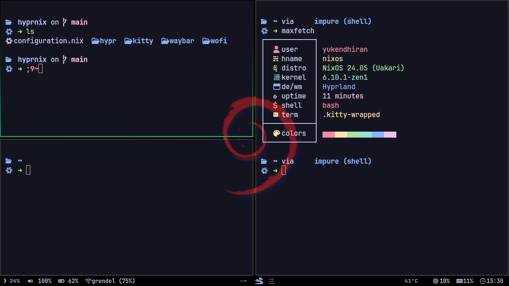

# Yuki's Nix

This is my personal Hyprland and NixOS configuration. You can use these dotfiles on other distros as well. In my Hyprland setup, everything works fine, including screen sharing. I've optimized my Nix configuration for the best performance. To search for NixOS options and packages, refer to the following links:

- [NixOS Options](https://search.nixos.org/options)
- [NixOS Packages](https://search.nixos.org/packages)

## General

- We've already freed up a lot of resources by replacing a heavy Desktop Environment with a Window Manager like Hyprland. I use the Zen kernel with BFQ and other optimizations. Check kernel parameters and boot-related settings for further tweaks.
- If you want to extract more performance, consider optimizing your browser (Floorp for Firefox base, Vivaldi for Chromium base).
- Replace your IDE with Neovim or Emacs. LazyVim is very easy to get started with, and you can follow System Crafters on YouTube for Emacs tutorials.

## Alert

- **For Experienced Linux Users**: If you're already familiar with Linux and have used it on bare metal, this config will make it easy to get started with WM and customizing Linux (Ricing).
- **For New Linux Users**: If you've never used Linux, be prepared to learn a lot. Even though you can reproduce this config, it requires a significant mindset shift.
- This config is not just about installation; there will be a quick walkthrough on how to edit your own config and set up things.
- **Why not Nix Flakes and Home-manager?**: They are still experimental, and the success rate of reproducing someone else's config is lower compared to using the traditional `configuration.nix`. In my personal experience, getting Hyprland screen sharing to work properly was challenging. In my config, screen sharing works fine with Vivaldi (only tested on Google Meet), but I had some issues with Floorp.
- You can use these dotfiles on any distro of your choice.

## Let's Get Started

1. Install NixOS with a live ISO. Use Ventoy to make a multi-boot pendrive. I personally just install Ventoy on my pendrive and use it as a normal pendrive. It is bootable, and you just need to copy-paste the ISO into the root directory (not in subfolders). The boot menu will show the number of options.

   - Some Linux distributions require you to use Etcher, but I got NixOS working with Ventoy. I just booted in normal mode, and the live session started.

2. While installing, choose the Desktop Environment of your choice. This is one of the things I like about NixOS. For example, if you choose GNOME during installation, after the first boot, you can replace everything using my config and rebuild. At the boot menu, you will be presented with two configs: one for the initial installation and one for the new config. It's extremely easy to rollback at any point in time.

3. After the first boot, go to the `/etc/nixos` directory:
   ```bash
   cd /etc/nixos
   ```
4. List the files:

   ```bash
   ls
   ```

### Warning: Don't touch hardware-configuration.nix.

5. Use any editor like code, nvim, or nano. You can use the following command to get a shell with your preferred editor:

```bash

nix-shell -p APP_NAME
```

Nano is built-in for quick edits, but you can use other editors if you prefer.

6. Open configuration.nix, then go to my repository and open my Nix configuration. Use the NixOS options search to find what I have declared there. By searching every option, you can tailor the config for your system. For example, I don't have an NVIDIA or AMD card, only an integrated GPU, so by searching, you can determine what is needed for your system.

   - If your laptop is listed here, add it to the imports and include their repo:
     [NixOS Hardware.](https://github.com/NixOS/nixos-hardware)

7. After crafting the config, build the system using:

```bash
sudo nixos-rebuild switch --upgrade
```

8. Clone my repository and copy all folders to your .config folder:

```bash
 cp -r FOLDER_NAME ~/.config
```

9. Reboot your system, and you will have my configuration. The failure rate in this process is very low, and you can customize your OS as needed.

   - If failure happens or if you do something you don't understand, like disabling the display manager, which logs you into CLI instead of a graphical interface, you can easily roll back and have a system like a fresh install. Then, edit the config and rebuild the system.
   - Tip: Don't remove anything; just comment it out so you can easily refer back to it later.

## Screen Shot:



## After or before everything else, go to the dotfiles and check the configuration. If you've never used a window manager (WM) before, try to understand the config files before rebuilding the OS, as everything will be based on keybindings.
